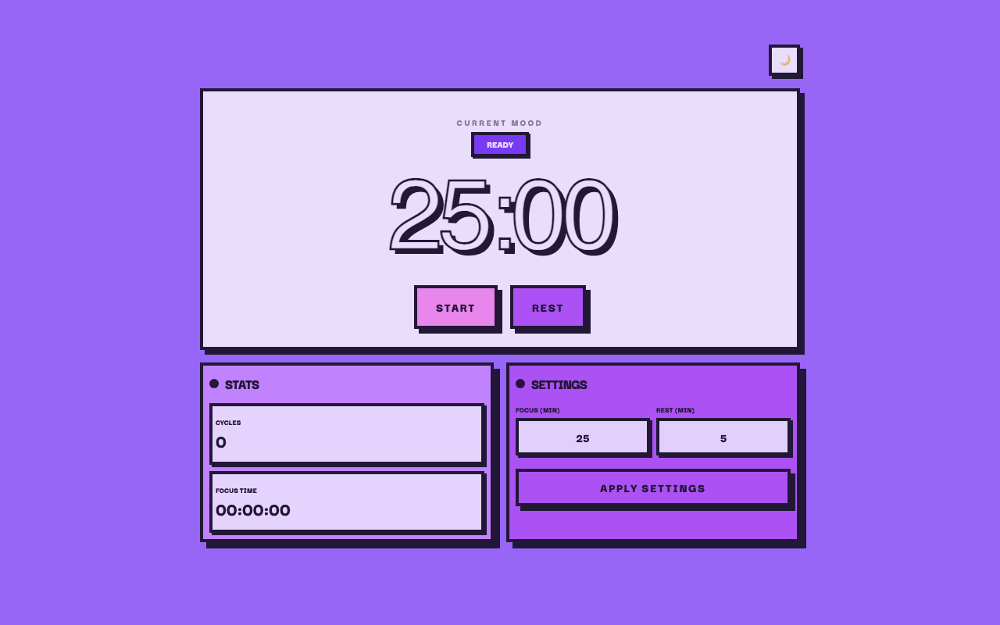

# 🍅 Pomodoro Neobrutalista

Um cronômetro Pomodoro moderno com estética **Neobrutalista**, construído para ser rápido, funcional e visualmente impactante.



### 📍 Sobre o Projeto

Este projeto nasceu de um desafio do curso de [Luiz Otávio Miranda](https://www.udemy.com/user/luiz-otavio-miranda/), evoluindo para uma aplicação completa com:
- **Estética Bento Box**: Layout organizado em cards com sombras sólidas.
- **Modo Dia/Noite**: Suporte total a temas claros e escuros.
- **Timer de Alta Precisão**: Lógica baseada em timestamps (`Date.now()`) para garantir precisão mesmo com a aba em segundo plano.
- **Mobile Friendly**: Layout responsivo para qualquer dispositivo.

---

### 🛠 Tecnologias Utilizadas

- **React 19** + **TypeScript**
- **Vite 8** (Build rápido)
- **Tailwind CSS v4** (Estilização moderna e performática)
- **Framer Motion** (Animações fluidas)
- **Google Fonts** (Bricolage Grotesque e Darker Grotesque)

---

### ⭐ Como rodar localmente?

Este projeto utiliza o [Bun](https://bun.sh) para máxima performance, mas funciona perfeitamente com Node/NPM.

1. **Clone o repositório:**
```shell
git clone https://github.com/stherzada/pomodoro.git
cd pomodoro
```

2. **Instale as dependências:**
```shell
bun install
# ou
npm install
```

3. **Inicie o servidor de desenvolvimento:**
```shell
bun dev
# ou
npm run dev
```

4. **Acesse:** `http://localhost:5173`

---

### 📄 O que foi implementado?
- [x] Refatoração completa da UI (Neobrutalismo).
- [x] Lógica de Timer resiliente a background throttling.
- [x] Configurações personalizáveis de tempo.
- [x] Histórico de ciclos e tempo de foco.
- [x] Toggle de Tema (Day/Night).

---
<div align="center">Feito com 🤍 por <a href="https://www.linkedin.com/in/sthefany-sther/" target="_blank">Sther</a></div>
